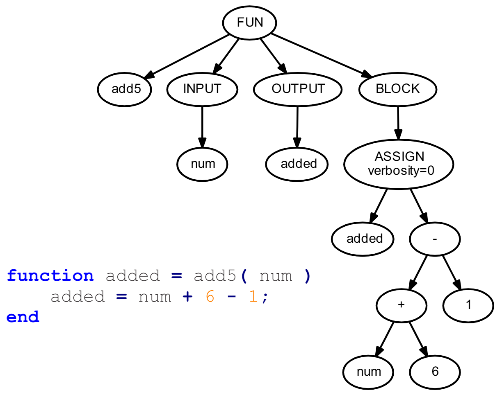

# abc
test

====
这里将显示出一个图片

====
这里测试 Latex 语法

下面将显示一个矩阵

$\left|                --左边的竖线
\begin{array}{lcr}     --一个array的开始, l/c/r表示列的对齐方式左/中/右
a & b & c \\           --&分隔列 \\换行 
d & e & f 
\end{array}            --一个array的结束
\right|$               --右边的竖线